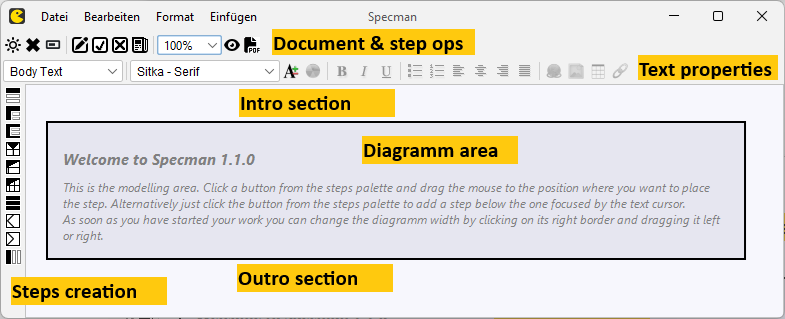

:toc:

# Specman 1.1 Manual

## Introduction
Specman is a WYSIWYG editor for actogramms, which are basically Nassi-Shneiderman-like diagramms with some graphical aspects taken over from UML activity diagramms. Specman is designed for the specification of procedural workflows in software systems, and came out of more than 15 years of experience in software engineering based on standard tools like Microsoft Word, Confluence and UML.

Microsoft Word is a perfect word processor with change tracking (a crucial aspect for iterative / agile development), but control structures like loops and branches are difficult to visualize. UML activity diagramms on the other hand are very good on visualizing control structures, but change tracking and diagramm layout stability in iterative development are poor. Specman makes a difference by combining various tooling aspects in a unique way which turned out to be crucial for highly efficient, iterative software development.

## Hello Specman
Specman is a small Java 2D / Swing application, which builds to an executable JAR file using Maven. To run Specman, you need a Java Runtime Environment (JRE) version 17 or higher installed. The main class is specman.Specman. Opening the file link:anagramms.nsd[anagramms.nsd] in Specman brings up the following diagramm on the screen

image::anagramms-screenshot.png[Two Word Anagramms Specman Diagramm]

A significant graphical difference to Nassi-Shneiderman diagramms is the representation of decisions nodes by diamonds as they are known from UML activity diagramms. The original Nassi-Shneiderman notation uses triangles which causes a little messy impression when they occur repeatedly in a diagramm.

Every structured step within a diagramm may be folded up, to hide the details of its inner structure. The following screenhot shows how the "Two Word Anagramms" diagramm looks like when all steps are folded up:

image::anagramms-folded-screenshot.png[Two Word Anagramms Folded]

The requirement in the description of the example is taken from a link:https://codingdojo.org/kata/Anagram/[code kata] published on codingdojo.org which perfectly illustrates what Specman and actogramms are made for: up-front design - both structured and change-friendly - rather than "design a little, code a little", which is a wide-spread antipattern. Check out link:https://clean-code-developer.com/[clean-code-developer.com] why it's anti. Writing code directly from the business requirements has a high risk to end up in spaghetti code even though the task doesn't sound too complicated at first glance. No big problem in one-shot coding, but a nightmare in iterative development where requirements are constantly in change.

### File format
The diagramm files have a JSON-based file format which makes them machine-readable e.g. to feed code generators or AI agent based programming pipelines. However, Specman was designed to produce  specifications which are both human-readable and technically exact. Software gets designed before implementation, following basic clean code development principles and the central ideas of Domain-Driven Design. The designs are represented in a way which allows business stakeholders to actively participate in the design process.

### PDF export
Specman provides a high-quality PDF export, so that the diagramms can be shared easily with everybody involved in the software engineering process. Reviewers only need a standard tool like Adobe's Acrobat Reader to open and comment the exported diagramms. See link:anagramms-export.pdf[anagramms-export.pdf] for an example of a PDF export of the "Anagrams" diagramm.

### Change tracking
The yellow highlighting in the screenshot above indicates changes which were made in change mode. Similar to Microsoft Word, e.g. deleting text in change mode does not actually cause the text do disappear but displayed as crossed out with a yellow background as if someone had marked the section with a text marker. Changes in a model are therefore immediately recognizable by everybody. This is a crucial aspect in iterative development where specifications evolve over time.

Folding up a structured step which includes any change marks will cause the unfold-button beside the step number to be displayed with a yellow background. I.e. even if details are hidden, it is still visible that there are changes in the folded up section.

## Specman Main Window structure
Starting Specman brings up an empty window with the following areas.

The diagramm area is initially empty as well as the intro and outro sections above and below. These sections are important in real-world applications where they contain additional context information like preconditions, postconditions, actors, references to related documents etc. For an impression how this may look like, see the link:usecase-birdsview.png[bird's view] on a mid-size system usecase specification from ongoing project development.

## Populating the diagramm
The diagramm gets populated by using the steps creation toolbar at the left of the window. Pressing a button in the toolbar creates a new step of the corresponding type in the diagramm area. The new step is always created below the step which the currently focused edit area is in. If the current focus is not within a step's edit area, the new step is created at the end of the diagramm.

As an alternative, most steps can be created by drag & drop by pressing the corresponding button from the toolbar, keeping the mouse pressed, moving it to the right place in the diagramm and releasing the mouse button there. A half-transparent grey insertion bar indicates where the new step will be created when the mouse button is released.

The steps creation bar provides the following buttons:

image::../src/main/resources/images/einfacher-schritt.png[Simple Step]
Creates a simple step in the diagramm. The new step is immediately focused, i.e. pressing the button multiple times creates multiple steps one after the other.

image::../src/main/resources/images/subsequenz-schritt.png[Sub Sequence Step]
Creates a subsequence of steps with an initial simple step immediately added within. Subsequences are not part of original Nassi-Shneidermann diagrammens. They bring structure into larger sequences like chapters in a book. These sub structure may be directly used as a reasonable indicator for how to structure the code when implementing the specification.

The steps within the subsequence are numbered on a lower level, e.g. step 2.1, 2.2, 2.3 within subsequence step 2.

Subsequences can be folded up to hide its content when the details are currently not of interest. Placing the mouse directly right of the subsequence's step number brings up a small button with a minus sign. Pressing this button folds up the subsequence. The button then shows a plus sign for unfolding the subsequence again.

image::../src/main/resources/images/while-schritt.png[While Step]
Creates a loop step with an initial simple step in its repetition sequence immediately added. The repetitions sequence must not be empty. So if the first step must be a different one than a simple step, add a step of the required type and remove the initial first step afterward.

image::../src/main/resources/images/whilewhile-schritt.png[While While Step]
Creates a loop step with an additional horizontal empty bar at the bottom. This is functionally identical with the loop step, but sometimes it is optically clearer to understand of a loop as an easily recognizable graphical boundary at the bottom. E.g. if there are catch steps at the end of the loop's repetition sequence.

image::../src/main/resources/images/ifelse-schritt.png[If Else Step]
Creates an if-else step with an initial simple step in its if and else branch. The division ratio of the branches may be changed by clicking on the separating line between the branches and moving it right or left.

image::../src/main/resources/images/if-schritt.png[If Step]
Creates an if step. As a difference to the if-else step, the left branch is empty and its width cannot be modified.

image::../src/main/resources/images/case-schritt.png[Case Step]
Creates a case step which the default branch on the left and two initial other case branches on the right. Additional branches can be added by pressing the the corresponding button from the steps creation toolbar (see below). Branch removal is achieved by placing the cursor in the branch's heading / resp. condition edit area and pressing the delete button from the step & document properties toolbar. However, two case branches and the default branch are the minimum which a case step has to provide. Otherwise it's an if or if-else step.

image::../src/main/resources/images/zweig.png[New Branch]
Creates a new branch in a previously created case step. The creation by button click requires to place the cursor into an existing branch's heading edit area first. The new branch is then added _left_ from the cursor-selected branch. Alternatively the new branch can be created by drag & drop which requires to drag into an existing branch's heading. A vertical insertion bar indicates where the new branch will be created when releasing the mouse button.

image::../src/main/resources/images/break-schritt.png[Break Step]
Creates a break step which can be understood as the occurence of business exception. It causes the following steps to be skipped down to the place where the exceptions gets caught. If it is not caught anywhere the exceptions causes the complete usecase to be aborted which is described in the diagramm. Whoever, this is usually not a good idea as it makes the reader wonder if this was designed by intention or if the design is not yet complete.

image::../src/main/resources/images/catch-schritt.png[Catch Step]
Creates a catch step for a previously defined break step. This is the only kind of step which unfortunately cannot be created by drag & drop yet and the creation takes the following steps.

* Place the cursor into any step of the sequence which the catch step is supposed to be added at the very end.
* Press the catch step button from the steps creation toolbar. This brings up a dialog for break step selection. The dialog allows to choose from all break steps
** which are not already coupled with a catch step yet and
** which are present in the step sequence which the catch step is about to be attached to, resp. in any of its nested sequences
* After break step selection, the coupled catch step is added, including a handling sequence with an initial simple step.

Catch steps are displayed in an optically separated sections with a gray bar above and below, making clear that this is not part of the normal control flow. Multiple catch steps for the same sequence are usually placed side by side which is