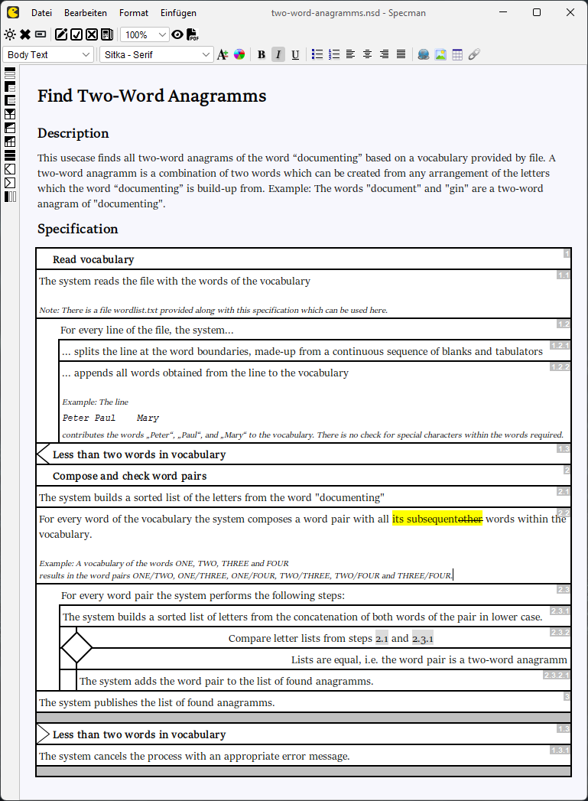
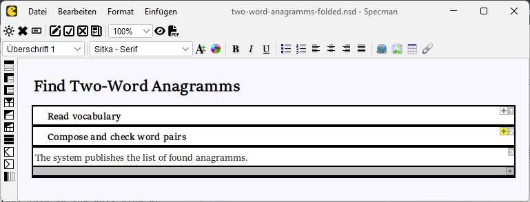

# Specman Diagramm Editor

Specman is a WYSIWYG editor for actogramms, which are basically Nassi-Shneiderman-like diagramms with some graphical aspects taken over from UML activity diagramms. Specman is designed for the specification of procedural workflows in software systems, and came out of more than 15 years of experience in software engineering based on standard tools like Microsoft Word, Confluence and UML.

Microsoft Word is a perfect word processor with change tracking (a crucial aspect for iterative / agile development), but control structures like loops and branches are difficult to visualize. UML activity diagramms on the other hand are very good on visualizing control structures, but change tracking and diagramm layout stability in iterative development are poor. Specman makes a difference by combining various tooling aspects in a unique way which turned out to be crucial for highly efficient, iterative software development.

## Hello Specman
Specman is a small Java 2D / Swing application, which builds to an executable JAR file using Maven. To run Specman, you need a Java Runtime Environment (JRE) version 17 or higher installed. The main class is specman.Specman. Opening the file link:doc/anagramms.nsd[anagramms.nsd] in Specman brings up the following diagramm on the screen

A significant graphical difference to Nassi-Shneiderman diagramms is the representation of decisions nodes by diamonds as they are known from UML activity diagramms. The original Nassi-Shneiderman notation uses triangles which causes a little messy impression when they occur repeatedly in a diagramm.

Every structured step within a diagramm may be folded up, to hide the details of its inner structure. The following screenhot shows how the "Two Word Anagramms" diagramm looks like when all steps are folded up:

The requirement in the description of the example is taken from a link:https://codingdojo.org/kata/Anagram/[code kata] published on codingdojo.org which perfectly illustrates what Specman and actogramms are made for: up-front design - both structured and change-friendly - rather than "design a little, code a little", which is a wide-spread antipattern. Check out link:https://clean-code-developer.com/[clean-code-developer.com] why it's anti. Writing code directly from the business requirements has a high risk to end up in spaghetti code even though the task doesn't sound too complicated at first glance. No big problem in one-shot coding, but a nightmare in iterative development where requirements are constantly in change.

### File format
The diagramm files have a JSON-based file format which makes them machine-readable e.g. to feed code generators or AI agent based programming pipelines. However, Specman was designed to produce  specifications which are both human-readable and technically exact. Software gets designed before implementation, following basic clean code development principles and the central ideas of Domain-Driven Design. The designs are represented in a way which allows business stakeholders to actively participate in the design process.

### PDF export
Specman provides a high-quality PDF export, so that the diagramms can be shared easily with everybody involved in the software engineering process. Reviewers only need a standard tool like Adobe's Acrobat Reader to open and comment the exported diagramms. See link:doc/anagramms-export.pdf[anagramms-export.pdf] for an example of a PDF export of the "Anagrams" diagramm.

### Change tracking
The yellow highlighting in the screenshot above indicates changes which were made in change mode. Similar to Microsoft Word, e.g. deleting text in change mode does not actually cause the text do disappear but displayed as crossed out with a yellow background as if someone had marked the section with a text marker. Changes in a model are therefore immediately recognizable by everybody. This is a crucial aspect in iterative development where specifications evolve over time.

Folding up a structured step which includes any change marks will cause the unfold-button beside the step number to be displayed with a yellow background. I.e. even if details are hidden, it is still visible that there are changes in the folded up section.

## Manual
The complete manual is available at link:doc/specman-manual.adoc[Specman Manual].

For an impression how real-world specifications look like in Specman, see the link:doc/usecase-birdsview.png[bird's view] on a mid-size system usecase specification from ongoing project development.
