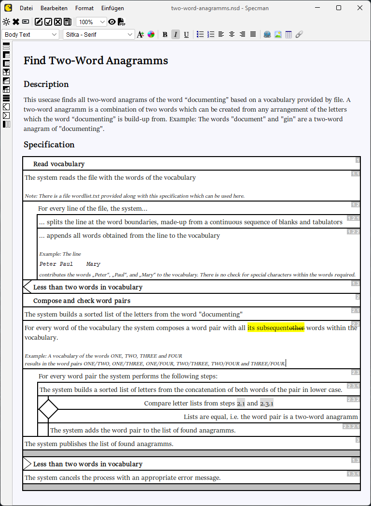
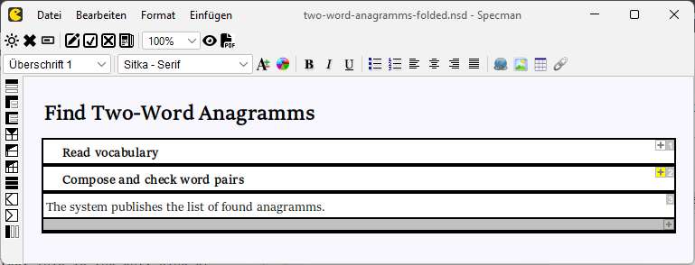

# Specman Diagramm Editor

Specman is a WYSIWYG editor for actogramms, which are basically Nassi-Shneiderman-like diagramms with some graphical aspects taken over from UML activity diagramms. Specman is designed for the specification of procedural workflows in software systems, and came out of more than 15 years of experience in software engineering based on standard tools like Microsoft Word, Confluence and UML.

Microsoft Word is a perfect word processor with change tracking (a crucial aspect for iterative / agile development), but control structures like loops and branches are difficult to visualize. UML activity diagramms on the other hand are very good on visualizing control structures, but change tracking and diagramm layout stability in iterative development are poor. Specman makes a difference by combining various tooling aspects in a unique way which turned out to be crucial for highly efficient, iterative software development.

## Hello Specman
Specman is a small Java 2D / Swing application, which builds to an executable JAR file using Maven. To run Specman, you need a Java Runtime Environment (JRE) version 17 or higher installed. The main class is specman.Specman. Opening the file link:doc/anagramms.nsd[anagramms.nsd] in Specman brings up the following diagramm on the screen

A significant graphical difference to Nassi-Shneiderman diagramms is the representation of decisions nodes by diamonds as they are known from UML activity diagramms. The original Nassi-Shneiderman notation uses triangles which causes a little messy impression when they occur repeatedly in a diagramm.

Every structured step within a diagramm may be folded up, to hide the details of its inner structure. The following screenhot shows how the "Two Word Anagramms" diagramm looks like when all steps are folded up:

The requirement in the description of the example is taken from a link:https://codingdojo.org/kata/Anagram/[code kata] published on codingdojo.org which perfectly illustrates what Specman and actogramms are made for: up-front design - both structured and change-friendly - rather than "design a little, code a little", which is a wide-spread antipattern. Check out link:https://clean-code-developer.com/[clean-code-developer.com] why it's anti. Writing code directly from the business requirements has a high risk to end up in spaghetti code even though the task doesn't sound too complicated at first glance. No big problem in one-shot coding, but a nightmare in iterative development where requirements are constantly in change.

### File format
The diagramm files have a JSON-based file format which makes them machine-readable e.g. to feed code generators or AI agent based programming pipelines. However, Specman was designed to produce  specifications which are both human-readable and technically exact. Software gets designed before implementation, following basic clean code development principles and the central ideas of Domain-Driven Design. The designs are represented in a way which allows business stakeholders to actively participate in the design process.

### PDF export
Specman provides a high-quality PDF export, so that the diagramms can be shared easily with everybody involved in the software engineering process. Reviewers only need a standard tool like Adobe's Acrobat Reader to open and comment the exported diagramms. See link:doc/anagramms-export.pdf[anagramms-export.pdf] for an example of a PDF export of the "Anagrams" diagramm.

### Change tracking
The yellow highlighting in the screenshot above indicates changes which were made in change mode. Similar to Microsoft Word, e.g. deleting text in change mode does not actually cause the text do disappear but displayed as crossed out with a yellow background as if someone had marked the section with a text marker. Changes in a model are therefore immediately recognizable by everybody. This is a crucial aspect in iterative development where specifications evolve over time.

Folding up a structured step which includes any change marks will cause the unfold-button beside the step number to be displayed with a yellow background. I.e. even if details are hidden, it is still visible that there are changes in the folded up section.

### Windows installer
Besides the plain executable JAR, Specman can be packaged as a Windows MSI installer with a bundled Java runtime, so end users don't need a JRE installed. Building the installer requires JDK 17+ (for `jpackage`) and the https://wixtoolset.org/[WiX Toolset] 3.14 on the `PATH`:

[source,shell]
----
mvn -P windows-installer clean package
----

The resulting `Specman-<version>.msi` is written to `target/installer/`. It installs per-user (no admin rights required), adds a Start menu entry and desktop shortcut, associates `.nsd` files with Specman, and adds a `specman-cli` console launcher for the link:src/main/java/specman/cli/SpecmanCLI.java[command-line operations]. Bumping `<version>` in `pom.xml` between releases lets a new installer upgrade an existing installation in place.

The installer also puts a `specman` command on the user's `PATH` (a small `specman.cmd` forwarder to `specman-cli.exe`, installed into its own `bin` subdirectory so it can't clash with `Specman.exe` — Windows filenames are case-insensitive). Open a *new* terminal after installing (PATH changes only apply to newly started processes) and run e.g. `specman --sanitize <file>`.

#### Known limitations
* *Build machine antivirus/EDR can block the build.* Some products (observed with Windows Defender) deny read access to `klist.exe`, a Kerberos tool bundled in the `java.security.jgss` module that gets pulled into the runtime image transitively (likely via asciidoctorj/JRuby or iText). This fails the WiX linking step with `light.exe : error LGHT0001 ... UnauthorizedAccessException`. Workaround: add a temporary exclusion for the jpackage temp directory before building, e.g. from an elevated PowerShell: `Add-MpPreference -ExclusionPath "$env:LOCALAPPDATA\Temp"`. Excluding the `java.security.jgss` module itself (Specman doesn't use Kerberos/SSO) would be a cleaner fix but hasn't been implemented/verified yet.
* *The installer and `Specman.exe`/`specman-cli.exe` are not code-signed.* On first run, Windows SmartScreen (and/or Defender) may block the unsigned executable ("Windows hat den PC geschützt"). For local testing: `Unblock-File <path-to-exe>`, or click "Weitere Informationen" → "Trotzdem ausführen" in the SmartScreen dialog, or add a Defender exclusion for the install directory. For real-world distribution this should be replaced by signing the MSI/EXE with an Authenticode certificate (`signtool sign /fd sha256 /tr <timestamp-url> ...`) so end users don't hit this at all.
* *Migrating from a manual `SPECMAN_HOME` + `specman.bat` setup does not automatically take over the `.nsd` file association.* Windows remembers an explicit prior choice (`HKCU\...\FileExts\.nsd\UserChoice`) and, in setups where the association was registered directly rather than picked via "Open with", also a plain `HKCU\Software\Classes\.nsd` entry pointing at the old ProgId/batch file — neither is overwritten by the new installer. After installing, reset both if `.nsd` files still open the old way:
+
[source,powershell]
----
Remove-Item -Path "HKCU:\Software\Microsoft\Windows\CurrentVersion\Explorer\FileExts\.nsd" -Recurse -Force -ErrorAction SilentlyContinue
Remove-Item -Path "HKCU:\Software\Classes\.nsd" -Force -ErrorAction SilentlyContinue
----
+
(the second command's target ProgId name depends on how the old install registered itself, e.g. `nsd_auto_file`; inspect `HKCU:\Software\Classes\.nsd` first to find it, and remove that ProgId key too). Then pick the new `Specman.exe` once via "Open with" → "Always use this app".
* *The bundled runtime is not module-trimmed.* jpackage's automatic `jdeps`-based module detection is used as-is (plus `--strip-debug`/`--no-header-files`/`--no-man-pages`), so the MSI is relatively large (~90 MB). A curated `--add-modules` list could shrink this but needs testing against every feature (PDF export, Asciidoc export, etc.) to avoid removing something actually required.
* *`src/main/jpackage/wix/main.wxs` is a hand-maintained copy of jpackage's internal WiX template* (extended with the `JpCliShim` component that adds `specman` to `PATH`). It was extracted from jpackage's own output via `jpackage --temp <dir> ...` (which leaves the generated WiX sources in `<dir>/config` instead of a throwaway temp folder) and is used via `--resource-dir`, which replaces only same-named resource files — everything else jpackage generates by default is unaffected. If the build JDK's jpackage version changes, re-extract the default template the same way and diff it against this file to pick up upstream changes. If the installer is ever switched from `--win-per-user-install` to a machine-wide install, `System="no"` on the `JpPathEnv` environment entry must become `System="yes"` (then admin rights are needed for the PATH change too).
* *End-to-end runtime testing is partially done.* PDF export from the packaged app has been confirmed working. Opening `.nsd` files via the file association and Asciidoc export have not yet been confirmed in this environment.

## Manual
The complete manual is available at link:doc/specman-manual.adoc[Specman Manual].

For an impression how real-world specifications look like in Specman, see the link:doc/usecase-birdsview.png[bird's view] on a mid-size system usecase specification from ongoing project development.
