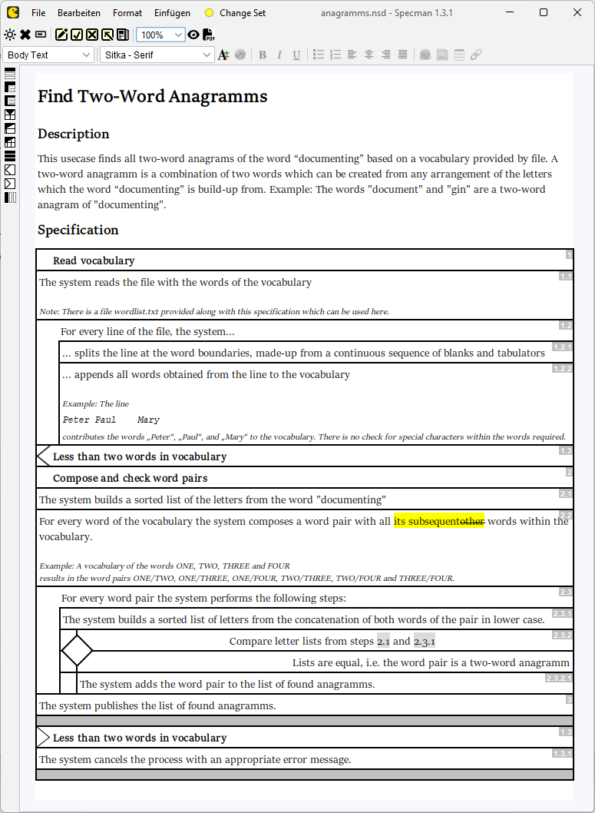
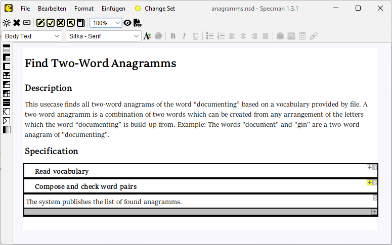

// Generated from howto/template-readme.adoc and doc/specman-manual.adoc by 'mvn package' - do not edit
# Specman Diagram Editor

Specman is a WYSIWYG editor for actogramms, which are basically Nassi-Shneiderman-like diagrams with some graphical aspects taken over from UML activity diagrams. Specman is designed for the specification of procedural workflows in software systems, and came out of more than 15 years of experience in software engineering based on standard tools like Microsoft Word, Confluence and UML.

Microsoft Word is a perfect word processor with change tracking (a crucial aspect for iterative / agile development), but control structures like loops and branches are difficult to visualize. UML activity diagrams on the other hand are very good at visualizing control structures, but change tracking and diagram layout stability in iterative development are poor. Specman makes a difference by combining various tooling aspects in a unique way which turned out to be crucial for highly efficient, iterative software development.

## Hello Specman
Specman is a small Java 2D / Swing application, which is built into an executable JAR file using Maven. To run Specman, you need a Java Runtime Environment (JRE) version 21 or higher installed. The main class is specman.Specman, and the delivery package includes launcher scripts for Windows (`specman.bat`) and Linux (`specman.sh`) that check the Java installation and locate the jar before starting the application. Opening the file link:doc/anagramms.nsd[anagramms.nsd] in Specman brings up the following diagram on the screen:

A significant graphical difference to Nassi-Shneiderman diagrams is the representation of decision nodes by diamonds as they are known from UML activity diagrams. The original Nassi-Shneiderman notation uses triangles which causes a little messy impression when they occur repeatedly in a diagram.

Every structured step within a diagram may be folded up, to hide the details of its inner structure. The following screenshot shows what the "Two Word Anagrams" diagram looks like when all steps are folded up:

The requirement in the description of the example is taken from a link:https://codingdojo.org/kata/Anagram/[code kata] published on codingdojo.org which perfectly illustrates what Specman and actogramms are made for: up-front design - both structured and change-friendly - rather than "design a little, code a little", which is a widespread antipattern. Check out link:https://clean-code-developer.com/[clean-code-developer.com] to see why it's an antipattern. Writing code directly from the business requirements has a high risk of ending up in spaghetti code even though the task doesn't sound too complicated at first glance. No big problem in one-shot coding, but a nightmare in iterative development where requirements are constantly changing.

### AI-ready file format
Since version 1.3, the diagram files have a pseudocode-like format which makes them machine-readable e.g. to feed code generators or AI agent based programming pipelines. The file structure follows an EBNF grammar defined in SpecmanModel_V002.g4, which is part of the delivery. It is explicitly designed to also integrate AI support in the process of creating specifications. Using Specman's autoload mode and its headless sanitizer makes it possible to set up a collaborative environment where the user is working with the WYSIWYG UI while an AI agent is supporting in the background. Specifications are supposed to be designed as both human-readable and technically exact, using a natural but precise language according to basic clean code development principles and the central ideas of Domain-Driven Design. The result is a document with structure and textual content which is perfectly understandable for AI agents.

### PDF export
Specman provides a high-quality PDF export, so that the diagrams can be shared easily with everybody involved in the software engineering process. Reviewers only need a standard tool like Adobe's Acrobat Reader to open and comment on the exported diagrams. See link:doc/anagramms-export.pdf[anagramms-export.pdf] for an example of a PDF export of the "Anagrams" diagram.

### Change tracking
The yellow highlighting in the screenshot above indicates changes which were made in change mode. Similar to Microsoft Word, e.g. deleting text in change mode does not actually cause the text to disappear but displayed as crossed out with a yellow background as if someone had marked the section with a text marker. Changes in a model are therefore immediately recognizable by everybody. This is a crucial aspect in iterative development where specifications evolve over time.

Folding up a structured step which includes any change marks will cause the unfold-button beside the step number to be displayed with a yellow background. I.e. even if details are hidden, it is still visible that there are changes in the folded up section.

Since version 1.2.1, Specman supports multiple change sets, which is of interest e.g. if there are multiple change requests to be considered in parallel within a single development iteration.

### Real world use case specifications
For an impression how real-world specifications look like in Specman, see the link:doc/usecase-birdsview.png[bird's view] on a mid-size system usecase specification from ongoing project development.

## Further information

### Manual
The complete manual is available at link:doc/specman-manual.adoc[Specman Manual].

### Building
For maintainers, the manual process for creating a GitHub release is described in link:howto/howto-github-release.adoc[How-to: Einen GitHub-Release manuell anlegen].

Project setup and creating of the Specman Windows installer is described in link:howto/howto-windows-installer.adoc[How-to: Specman Windows Installer].
